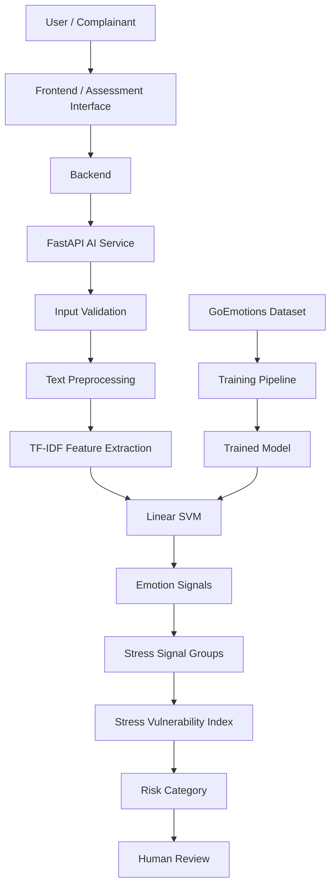

# RAAHAT-AI

## AI-Based Stress, Trauma & Distress Vulnerability Assessment

**Smart India Hackathon 2026 — SIH 26093**

> RAAHAT-AI is an AI/ML-based decision-support component designed to analyze emotionally relevant text, identify emotion signals, generate stress-related vulnerability indicators, and provide structured outputs for human review.

---

## Project Status


---

# Table of Contents

1. [Project Overview](#project-overview)
2. [Problem Statement](#problem-statement)
3. [Project Objective](#project-objective)
4. [Proposed Solution](#proposed-solution)
5. [Complete Project Workflow](#complete-project-workflow)
6. [Project Architecture](#project-architecture)
7. [Project Completion Roadmap](#project-completion-roadmap)
8. [Step 1 — Project Environment Setup](#step-1--project-environment-setup)
9. [Step 2 — Project Repository Setup](#step-2--project-repository-setup)
10. [Step 3 — Dataset Collection](#step-3--dataset-collection)
11. [Step 4 — Dataset Processing](#step-4--dataset-processing)
12. [Step 5 — Dataset Quality Validation](#step-5--dataset-quality-validation)
13. [Step 6 — Duplicate Analysis](#step-6--duplicate-analysis)
14. [Step 7 — Text Normalization](#step-7--text-normalization)
15. [Step 8 — Leakage Prevention](#step-8--leakage-prevention)
16. [Step 9 — Dataset Splitting](#step-9--dataset-splitting)
17. [Step 10 — Feature Engineering](#step-10--feature-engineering)
18. [Step 11 — Machine Learning Model](#step-11--machine-learning-model)
19. [Step 12 — Model Evaluation](#step-12--model-evaluation)
20. [Step 13 — Model Saving](#step-13--model-saving)
21. [Step 14 — Standalone Inference](#step-14--standalone-inference)
22. [Step 15 — FastAPI Integration](#step-15--fastapi-integration)
23. [Step 16 — API Testing](#step-16--api-testing)
24. [Step 17 — AI-to-Backend Handoff](#step-17--ai-to-backend-handoff)
25. [Step 18 — Responsible AI](#step-18--responsible-ai)
26. [Step 19 — Final Testing](#step-19--final-testing)
27. [Technology Stack](#technology-stack)
28. [Dataset Details](#dataset-details)
29. [Project Structure](#project-structure)
30. [Testing Evidence](#testing-evidence)
31. [Challenges and Solutions](#challenges-and-solutions)
32. [Limitations](#limitations)
33. [Future Scope](#future-scope)
34. [Member 2 Contribution](#member-2-contribution)
35. [Project Completion Checklist](#project-completion-checklist)
36. [Screenshots Gallery](#screenshots-gallery)
37. [How to Run](#how-to-run)
38. [API Documentation](#api-documentation)
39. [Responsible AI Disclaimer](#responsible-ai-disclaimer)
40. [Conclusion](#conclusion)

---

# Project Overview

RAAHAT-AI is the **AI/ML component of the RAAHAT project** developed for **Smart India Hackathon 2026, Problem Statement SIH 26093**.

The purpose of this component is to process emotionally relevant textual input and convert it into structured machine-learning signals that can assist the broader RAAHAT system.

The AI pipeline consists of:

```text
User Text
    ↓
Input Validation
    ↓
Text Preprocessing
    ↓
TF-IDF Feature Extraction
    ↓
Linear Support Vector Machine
    ↓
Emotion Classification
    ↓
Emotion Signals
    ↓
Stress Signal Groups
    ↓
Stress Vulnerability Index
    ↓
Risk Interpretation
    ↓
Human Review
```

The system is designed as a **decision-support system**.

It is **not a medical diagnostic system**.

---

# Problem Statement

Emotionally sensitive text may contain useful information about a person's emotional state and vulnerability.

Manually analyzing large volumes of such text can be difficult and time-consuming.

RAAHAT-AI addresses this technical challenge by providing an AI-assisted pipeline that can:

* Process textual input
* Detect emotion-related patterns
* Classify emotional signals
* Aggregate relevant signals
* Generate a structured vulnerability indicator
* Provide the result to downstream application components
* Keep human review in the decision-making process

---

# Project Objective

The major objectives of RAAHAT-AI are:

1. Prepare an appropriate emotion-related dataset.
2. Perform systematic dataset quality analysis.
3. Identify duplicate and repeated text.
4. Normalize text for grouping.
5. Prevent duplicate-related data leakage.
6. Create reliable training, validation and test datasets.
7. Convert text into numerical TF-IDF features.
8. Train a machine-learning classification model.
9. Evaluate the model.
10. Save the trained model for reuse.
11. Build standalone inference.
12. Expose inference through FastAPI.
13. Provide a stable AI-to-Backend interface.
14. Implement responsible-AI boundaries.
15. Document the complete AI/ML implementation.

---

# Proposed Solution

The proposed solution uses a classical Natural Language Processing pipeline.

```text
                RAAHAT-AI
                    │
                    ▼
              Text Input
                    │
                    ▼
            Text Preprocessing
                    │
                    ▼
                 TF-IDF
                    │
                    ▼
              Linear SVM
                    │
                    ▼
          Emotion Classification
                    │
                    ▼
             Emotion Signals
                    │
                    ▼
          Stress Signal Groups
                    │
                    ▼
       Stress Vulnerability Index
                    │
                    ▼
             Risk Category
                    │
                    ▼
             Human Review
```

---

# Complete Project Workflow

The project was completed through the following major phases:

```text
Phase 1
Environment Setup
        ↓
Phase 2
Repository Setup
        ↓
Phase 3
Dataset Collection
        ↓
Phase 4
Dataset Processing
        ↓
Phase 5
Data Quality Validation
        ↓
Phase 6
Duplicate Analysis
        ↓
Phase 7
Text Normalization
        ↓
Phase 8
Leakage Prevention
        ↓
Phase 9
Dataset Splitting
        ↓
Phase 10
Feature Engineering
        ↓
Phase 11
Model Training
        ↓
Phase 12
Model Evaluation
        ↓
Phase 13
Model Serialization
        ↓
Phase 14
Standalone Inference
        ↓
Phase 15
FastAPI Integration
        ↓
Phase 16
API Testing
        ↓
Phase 17
AI → Backend Integration
        ↓
Phase 18
Responsible AI
        ↓
Phase 19
Final Testing
```

---

# Project Architecture



---

# Project Completion Roadmap

| Step | Implementation          | Status    |
| ---- | ----------------------- | --------- |
| 1    | Environment Setup       | Completed |
| 2    | Repository Setup        | Completed |
| 3    | Dataset Collection      | Completed |
| 4    | Dataset Processing      | Completed |
| 5    | Data Quality Validation | Completed |
| 6    | Duplicate Analysis      | Completed |
| 7    | Text Normalization      | Completed |
| 8    | Leakage Prevention      | Completed |
| 9    | Dataset Splitting       | Completed |
| 10   | Feature Engineering     | Completed |
| 11   | Machine Learning Model  | Completed |
| 12   | Model Evaluation        | Completed |
| 13   | Model Saving            | Completed |
| 14   | Standalone Inference    | Completed |
| 15   | FastAPI Integration     | Completed |
| 16   | API Testing             | Completed |
| 17   | AI → Backend Handoff    | Completed |
| 18   | Responsible AI          | Completed |
| 19   | Final Testing           | Completed |

---

# Step 1 — Project Environment Setup

The first step was preparing the local development environment.

### Environment

```text
Operating System: Windows 11
Python: 3.13.5
pip: 25.3
Git: 2.55.0.windows.5
```

A Python virtual environment was created to isolate project dependencies.

```text
.venv/
```

### Why?

Virtual environments prevent project dependencies from interfering with globally installed Python packages.

### Verification

Python and pip versions were checked after environment setup.

### Screenshot Placeholder

> **Screenshot 1 — Python and Environment Setup**

```text
[INSERT SCREENSHOT HERE]

Show:
• Python version
• pip version
• Active virtual environment
• Windows terminal
```

---

# Step 2 — Project Repository Setup

The RAAHAT-AI project repository was created and organized into separate directories.

```text
RAAHAT-AI/
├── data/
├── docs/
├── images/
├── models/
├── outputs/
├── src/
├── tests/
├── screenshots/
├── api.py
├── requirements.txt
├── README.md
└── .gitignore
```

### Why?

Separating datasets, source code, models, outputs and tests improves maintainability.

### Screenshot Placeholder

> **Screenshot 2 — Project Folder Structure**

```text
[INSERT SCREENSHOT HERE]

Show:
• data
• docs
• images
• models
• outputs
• src
• tests
• screenshots
• api.py
• requirements.txt
```

---

# Step 3 — Dataset Collection

The project uses the **GoEmotions dataset** for emotion-related text classification.

The original CSV files were organized under:

```text
data/goemotions/
```

The observed source files included:

```text
goemotions_1.csv
goemotions_2.csv
goemotions_3.csv
```

Each source file contained approximately 70,000 observed rows during processing.

### Screenshot Placeholder

> **Screenshot 3 — GoEmotions Dataset**

```text
[INSERT SCREENSHOT HERE]

Show:
• data/goemotions folder
• CSV files
• Dataset filenames
```

---

# Step 4 — Dataset Processing

The raw dataset was processed into a project-specific consensus dataset.

Final processed file:

```text
data/goemotions/goemotions_consensus.csv
```

The processed dataset contains:

```text
54,263 records
```

### Main Columns

```text
id
text
emotions
num_consensus_emotions
text_group
```

### Why?

Processing the source data into a consistent project-specific format makes subsequent analysis and model training easier.

### Screenshot Placeholder

> **Screenshot 4 — Processed Dataset**

```text
[INSERT SCREENSHOT HERE]

Show:
• goemotions_consensus.csv
• Dataset columns
• Sample rows
```

---

# Step 5 — Dataset Quality Validation

Several quality checks were performed.

### Results

| Check                       | Result |
| --------------------------- | -----: |
| Total Records               | 54,263 |
| Missing Text                |      0 |
| Missing Emotion Information |      0 |
| Duplicate IDs               |      0 |

This confirmed that the processed dataset had no missing text/emotion values in the observed validation and no duplicate IDs.

### Screenshot Placeholder

> **Screenshot 5 — Dataset Quality Validation**

```text
[INSERT SCREENSHOT HERE]

Show:
• Total rows
• Missing values
• Duplicate IDs
• Validation output
```

---

# Step 6 — Duplicate Analysis

Duplicate analysis was one of the important data-engineering steps.

The analysis identified:

```text
269 duplicate raw text values
435 rows involved
166 unique duplicate groups
74 duplicate groups with different emotion sets
```

### Why Was This Important?

If duplicate or nearly identical records are distributed across training and testing datasets, evaluation results can become overly optimistic.

Therefore, duplicate analysis was performed before splitting the dataset.

### Screenshot Placeholder

> **Screenshot 6 — Raw Duplicate Analysis**

```text
[INSERT SCREENSHOT HERE]

Show:
• Duplicate text count
• Duplicate groups
• Different emotion-set observation
```

---

# Step 7 — Text Normalization

A normalized version of the text was created to identify related text records.

The normalized grouping column was:

```text
text_group
```

Observed results:

```text
Unique text groups: 53,943
Duplicate groups: 186
Rows in duplicate groups: 506
```

### Why?

Two texts can differ in superficial formatting while still representing the same underlying text.

Normalization makes it possible to group such records more consistently.

### Screenshot Placeholder

> **Screenshot 7 — Text Normalization**

```text
[INSERT SCREENSHOT HERE]

Show:
• text_group column
• Normalized text grouping
• Duplicate group results
```

---

# Step 8 — Leakage Prevention

The project uses a group-aware splitting strategy.

The key technique is:

```python
GroupShuffleSplit(random_state=42)
```

Instead of treating every row as completely independent, normalized text groups are considered during splitting.

### Workflow

```text
Text
 ↓
Normalization
 ↓
text_group
 ↓
Group Identification
 ↓
GroupShuffleSplit
 ↓
Train / Validation / Test
```

### Why?

This reduces the possibility that the same normalized text group appears in both training and evaluation partitions.

### Screenshot Placeholder

> **Screenshot 8 — Leakage Prevention**

```text
[INSERT SCREENSHOT HERE]

Show:
• GroupShuffleSplit
• random_state=42
• text_group based splitting
```

---

# Step 9 — Dataset Splitting

The processed dataset was divided into training, validation and test sets.

### Final Observed Split

| Dataset    |       Rows |
| ---------- | ---------: |
| Training   |     43,412 |
| Validation |      5,418 |
| Test       |      5,433 |
| **Total**  | **54,263** |

### Training Set

Used to train the machine-learning model.

### Validation Set

Used during model development and comparison.

### Test Set

Reserved for final evaluation.

### Screenshot Placeholder

> **Screenshot 9 — Train Validation Test Split**

```text
[INSERT SCREENSHOT HERE]

Show:
• Training rows
• Validation rows
• Test rows
• Group counts if available
• random_state
```

---

# Step 10 — Feature Engineering

Raw text cannot be directly processed by a traditional machine-learning classifier.

Therefore, text was converted into numerical features.

RAAHAT-AI uses:

## TF-IDF

**Term Frequency–Inverse Document Frequency**

```text
Raw Text
   ↓
Text Processing
   ↓
TF-IDF Vectorization
   ↓
Numerical Feature Matrix
   ↓
Machine Learning Model
```

### Why TF-IDF?

TF-IDF provides an efficient sparse representation of text and works well with linear text-classification algorithms.

### Screenshot Placeholder

> **Screenshot 10 — TF-IDF Feature Engineering**

```text
[INSERT SCREENSHOT HERE]

Show:
• TF-IDF implementation
• Feature extraction
• Training pipeline
```

---

# Step 11 — Machine Learning Model

The primary classification model used is:

## Linear Support Vector Machine

A Linear Support Vector Machine is suitable for high-dimensional sparse text representations.

### Pipeline

```text
Text
 ↓
TF-IDF
 ↓
Linear SVM
 ↓
Emotion Prediction
```

### Why Linear SVM?

The model was selected because it provides a practical balance between:

* Performance
* Computational efficiency
* Simplicity
* Reproducibility
* Deployment practicality

### Screenshot Placeholder

> **Screenshot 11 — Model Training**

```text
[INSERT SCREENSHOT HERE]

Show:
• Model training code
• Linear SVM
• Training output
```

---

# Step 12 — Model Evaluation

The model evaluation process considers:

* Accuracy
* Precision
* Recall
* F1 Score
* Confusion Matrix

### Why Multiple Metrics?

Accuracy alone may not adequately represent model behavior when different classes have different distributions.

Precision and recall provide additional information about prediction quality.

F1 Score combines precision and recall.

The confusion matrix helps identify which emotion classes are being confused.

### Important

Exact final numerical metrics should always be shown from the actual verified evaluation output rather than manually entered values.

### Screenshot Placeholder

> **Screenshot 12 — Model Evaluation Results**

```text
[INSERT SCREENSHOT HERE]

Show:
• Accuracy
• Precision
• Recall
• F1 Score
• Classification report
```

---

# Step 13 — Model Saving

After training and evaluation, the trained model and required preprocessing components can be stored for later inference.

The project contains:

```text
models/
```

### Why?

A production-style AI system should not retrain the model every time a user requests a prediction.

Instead:

```text
Training
   ↓
Model Artifact
   ↓
Save
   ↓
Inference
```

### Screenshot Placeholder

> **Screenshot 13 — Saved Model Artifacts**

```text
[INSERT SCREENSHOT HERE]

Show:
• models folder
• model files
• preprocessing/vectorizer artifacts if present
```

---

# Step 14 — Standalone Inference

The inference pipeline was separated from the training workflow.

The API imports:

```python
from src.inference import run_inference
```

This means the Backend can request predictions without running the training pipeline.

### Inference Flow

```text
Input Text
    ↓
Load Model
    ↓
Preprocess
    ↓
TF-IDF Transform
    ↓
Model Prediction
    ↓
Signal Processing
    ↓
Result
```

### Screenshot Placeholder

> **Screenshot 14 — Standalone Inference**

```text
[INSERT SCREENSHOT HERE]

Show:
• src/inference.py
• run_inference()
• Successful prediction output
```

---

# Step 15 — FastAPI Integration

A FastAPI service was created in:

```text
api.py
```

The API provides:

```text
GET  /
POST /predict
```

### FastAPI Architecture

```text
Client
  ↓
FastAPI
  ↓
Pydantic Validation
  ↓
run_inference()
  ↓
AI/ML Pipeline
  ↓
JSON Response
```

### Screenshot Placeholder

> **Screenshot 15 — FastAPI Application**

```text
[INSERT SCREENSHOT HERE]

Show:
• api.py
• FastAPI app
• endpoints
```

---

# Step 16 — API Testing

The FastAPI application provides interactive API documentation through Swagger.

Start the server:

```powershell
uvicorn api:app --reload
```

Open:

```text
http://127.0.0.1:8000/docs
```

### Health Endpoint

```text
GET /
```

Expected response:

```json
{
  "service": "RAAHAT AI",
  "status": "running",
  "diagnostic": false
}
```

### Prediction Endpoint

```text
POST /predict
```

Example request:

```json
{
  "text": "I feel scared and confused about what is happening."
}
```

### Screenshot Placeholder

> **Screenshot 16 — Swagger API Documentation**

```text
[INSERT SCREENSHOT HERE]

Show:
• / endpoint
• /predict endpoint
• Swagger UI
```

---

# Step 17 — AI-to-Backend Handoff

A major objective of Member 2 was to make the AI component usable by the Backend team.

The handoff architecture is:

```text
                    MEMBER 2
                       │
                       ▼
              AI/ML Inference
                       │
                       ▼
                FastAPI Service
                       │
                       ▼
                 API Contract
                       │
                       ▼
                    MEMBER 3
                       │
                       ▼
               Backend Application
```

### AI Responsibilities

Member 2 provides:

* Model
* Preprocessing
* Feature extraction
* Inference
* Emotion signals
* Vulnerability logic
* API interface
* Error behavior
* Documentation

### Backend Responsibilities

The Backend consumes the AI service and integrates its output into the larger application.

### Screenshot Placeholder

> **Screenshot 17 — AI to Backend Integration**

```text
[INSERT SCREENSHOT HERE]

Show:
• API request
• API response
• Backend integration or Postman/Swagger evidence
```

---

# Step 18 — Responsible AI

Responsible AI was considered throughout the project.

RAAHAT-AI does not claim to diagnose mental-health conditions.

The system should be understood as:

```text
Emotion Signal
      ↓
AI-Assisted Indicator
      ↓
Human Review
```

Not:

```text
Emotion Signal
      ↓
Medical Diagnosis
```

### Responsible AI Principles

* Human-in-the-loop decision making
* No clinical diagnosis claims
* Awareness of dataset bias
* Privacy awareness
* Data minimization
* Controlled interpretation
* Clear limitations
* Model governance

### Screenshot Placeholder

> **Screenshot 18 — Responsible AI / Project Documentation**

```text
[INSERT SCREENSHOT HERE]

Show:
• Responsible AI documentation
• Non-diagnostic disclaimer
• Human review principle
```

---

# Step 19 — Final Testing

The final stage involved checking the complete AI service.

### Final Testing Flow

```text
API Starts
   ↓
Health Check
   ↓
Input Validation
   ↓
Prediction Request
   ↓
Inference
   ↓
Output
   ↓
Error Handling
```

The API distinguishes between:

### HTTP 400

Used when inference raises a `ValueError`.

### HTTP 500

Used for unexpected inference failures.

The current API returns:

```json
{
  "detail": "AI inference failed."
}
```

for unexpected inference failures.

### Screenshot Placeholder

> **Screenshot 19 — Final API Testing**

```text
[INSERT SCREENSHOT HERE]

Show:
• Successful health check
• Successful prediction
• Error handling if available
```

---

# Technology Stack

## Programming

* Python 3.13

## Data Processing

* Pandas
* NumPy

## Machine Learning

* Scikit-learn

## NLP

* TF-IDF

## Classification

* Linear Support Vector Machine

## Model Serialization

* Joblib

## API

* FastAPI
* Pydantic
* Uvicorn

## Version Control

* Git
* GitHub

---

# Dataset Details

## Dataset

**GoEmotions**

The dataset was processed into a project-specific consensus dataset.

### Final Processed Dataset

```text
data/goemotions/goemotions_consensus.csv
```

### Records

```text
54,263
```

### Columns

```text
id
text
emotions
num_consensus_emotions
text_group
```

---

# Dataset Validation Summary

```text
Total Records                 : 54,263
Missing Text                  : 0
Missing Emotion Information   : 0
Duplicate IDs                 : 0
Raw Duplicate Text Values    : 269
Raw Duplicate Rows           : 435
Unique Duplicate Groups      : 166
Groups With Different Labels : 74
Unique Text Groups           : 53,943
Normalized Duplicate Groups  : 186
Rows in Duplicate Groups     : 506
```

---

# Project Structure

```text
RAAHAT-AI/
│
├── data/
│   └── goemotions/
│       └── goemotions_consensus.csv
│
├── docs/
│
├── images/
│
├── models/
│
├── outputs/
│
├── src/
│   └── inference.py
│
├── tests/
│
├── screenshots/
│
├── api.py
│
├── requirements.txt
│
├── README.md
│
└── .gitignore
```

---

# Testing Evidence

The project should maintain evidence for the major implementation stages.

Recommended evidence structure:

```text
screenshots/
│
├── 01-environment.png
├── 02-project-structure.png
├── 03-dataset.png
├── 04-processed-dataset.png
├── 05-data-quality.png
├── 06-duplicate-analysis.png
├── 07-text-normalization.png
├── 08-leakage-prevention.png
├── 09-dataset-split.png
├── 10-tfidf.png
├── 11-model-training.png
├── 12-model-evaluation.png
├── 13-model-artifacts.png
├── 14-inference.png
├── 15-fastapi.png
├── 16-swagger.png
├── 17-backend-integration.png
├── 18-responsible-ai.png
└── 19-final-testing.png
```

---

# Challenges and Solutions

## Challenge 1 — Duplicate Records

### Problem

Repeated text was present in the dataset.

### Solution

Duplicate analysis and normalized text grouping were performed.

---

## Challenge 2 — Different Labels for Repeated Text

### Problem

Some duplicate groups contained different emotion sets.

### Solution

The duplicate groups were analyzed rather than blindly deleting every repeated record.

---

## Challenge 3 — Data Leakage

### Problem

A normal random row-level split could place related text into multiple partitions.

### Solution

Group-aware splitting using:

```python
GroupShuffleSplit(random_state=42)
```

---

## Challenge 4 — Training and Inference Consistency

### Problem

A different preprocessing process during inference could produce incorrect predictions.

### Solution

The inference pipeline uses the same feature-processing approach as the trained model.

---

## Challenge 5 — Backend Integration

### Problem

The Backend should not depend on a training notebook.

### Solution

Standalone inference was separated and exposed through FastAPI.

---

## Challenge 6 — Responsible Interpretation

### Problem

Emotion classification can easily be misinterpreted as psychological diagnosis.

### Solution

The system explicitly uses non-clinical vulnerability indicators and retains human review.

---

# Limitations

RAAHAT-AI has several limitations.

### 1. Text-Based Analysis

The system only receives textual information and therefore cannot understand every aspect of a person's real-world situation.

### 2. Context

Words may have different meanings depending on context.

### 3. Sarcasm

Sarcasm and indirect communication can be difficult for traditional NLP models.

### 4. Dataset Bias

The GoEmotions dataset may not represent every population, language or cultural context.

### 5. Language Coverage

The current model is limited by its training data and should not be assumed to support every language equally.

### 6. Non-Clinical System

The model cannot determine whether a person has a psychological or medical condition.

### 7. Human Oversight

AI output requires appropriate human interpretation.

---

# Future Scope

Potential future improvements include:

## Multilingual NLP

Support for Indian and regional languages.

## Transformer Models

Experiment with contextual models such as transformer-based architectures after establishing appropriate evaluation.

## Better Explainability

Provide more detailed explanations of model outputs.

## Model Monitoring

Monitor:

* Model performance
* Prediction distributions
* Data drift
* Model drift

## Human Feedback

Introduce a controlled feedback mechanism to identify incorrect predictions and improve the system.

## Cloud Deployment

Deploy the validated inference service using appropriate cloud infrastructure.

## Security Improvements

Add:

* Authentication
* Authorization
* HTTPS
* Rate limiting
* Secure secrets management
* Audit logging

---

# Member 2 Contribution

## AI/ML Engineer

The AI/ML responsibilities were implemented as Member 2.

### Data Responsibilities

* Dataset collection
* Dataset processing
* Data quality analysis
* Missing-value verification
* Duplicate analysis
* Text normalization
* Group creation
* Leakage prevention
* Dataset splitting

### Machine Learning Responsibilities

* Feature engineering
* TF-IDF
* Linear SVM
* Model training
* Model evaluation
* Model serialization

### AI Logic Responsibilities

* Emotion signal processing
* Stress signal grouping
* Stress Vulnerability Index
* Risk interpretation

### Engineering Responsibilities

* Standalone inference
* FastAPI integration
* API validation
* API error handling
* AI-to-Backend contract

### Documentation Responsibilities

* AI/ML documentation
* Responsible AI
* Data governance
* Model governance
* Testing evidence
* Implementation screenshots

---

# Project Completion Checklist

```text
[x] Environment configured
[x] Python virtual environment created
[x] Git repository configured
[x] Project structure created
[x] GoEmotions dataset collected
[x] Dataset processed
[x] Consensus dataset created
[x] Missing-value validation completed
[x] Duplicate ID validation completed
[x] Duplicate text analysis completed
[x] Text normalization completed
[x] text_group created
[x] Leakage prevention implemented
[x] Group-aware splitting completed
[x] Training dataset created
[x] Validation dataset created
[x] Test dataset created
[x] TF-IDF feature engineering implemented
[x] Linear SVM implemented
[x] Model training completed
[x] Model evaluation workflow completed
[x] Model serialization implemented
[x] Standalone inference implemented
[x] FastAPI service implemented
[x] Health endpoint implemented
[x] Prediction endpoint implemented
[x] API validation implemented
[x] API error handling implemented
[x] Swagger documentation available
[x] Responsible AI documented
[x] AI → Backend interface defined
[x] Project documentation completed
```

---

# Screenshots Gallery

Replace the placeholders below with your actual screenshots.

## 1. Environment Setup


**Evidence:** Python, pip and development environment.

---

## 2. Project Structure


**Evidence:** RAAHAT-AI directory organization.

---

## 3. GoEmotions Dataset


**Evidence:** Original dataset files.

---

## 4. Processed Dataset


**Evidence:** `goemotions_consensus.csv`.

---

## 5. Dataset Quality


**Evidence:** Missing-value and duplicate-ID checks.

---

## 6. Duplicate Analysis


**Evidence:** Raw duplicate-text analysis.

---

## 7. Text Normalization


**Evidence:** `text_group` creation and normalized grouping.

---

## 8. Leakage Prevention


**Evidence:** Group-aware splitting.

---

## 9. Dataset Split


**Evidence:** Train/validation/test dataset sizes.

---

## 10. TF-IDF Feature Engineering


**Evidence:** TF-IDF implementation.

---

## 11. Model Training


**Evidence:** Linear SVM training.

---

## 12. Model Evaluation


**Evidence:** Evaluation metrics.

---

## 13. Model Artifacts


**Evidence:** Saved model/preprocessing artifacts.

---

## 14. Standalone Inference


**Evidence:** Standalone prediction pipeline.

---

## 15. FastAPI


**Evidence:** FastAPI application.

---

## 16. Swagger API


**Evidence:** Interactive API documentation.

---

## 17. Backend Integration


**Evidence:** AI-to-Backend communication.

---

## 18. Responsible AI


**Evidence:** Non-clinical and human-review principles.

---

## 19. Final Testing


**Evidence:** Final API and inference testing.

---

# How to Run

## Clone Repository

```bash
git clone https://github.com/tanjilakhatri/RAAHAT-AI.git
```

## Enter Directory

```bash
cd RAAHAT-AI
```

## Create Virtual Environment

```bash
python -m venv .venv
```

## Activate Environment — Windows

```powershell
.venv\Scripts\activate
```

## Install Requirements

```bash
pip install -r requirements.txt
```

## Start API

```bash
uvicorn api:app --reload
```

The service will run locally at:

```text
http://127.0.0.1:8000
```

---

# API Documentation

FastAPI automatically generates interactive documentation.

Open:

```text
http://127.0.0.1:8000/docs
```

Available endpoints:

```text
GET  /
POST /predict
```

---

# Health Check

### Request

```text
GET /
```

### Response

```json
{
  "service": "RAAHAT AI",
  "status": "running",
  "diagnostic": false
}
```

---

# Prediction API

### Request

```text
POST /predict
```

### Body

```json
{
  "text": "I feel scared and confused about the situation."
}
```

The API sends the text to:

```python
run_inference(request.text)
```

and returns the inference result.

---

# API Error Handling

## HTTP 400

A `ValueError` generated during inference is converted into:

```text
400 Bad Request
```

## HTTP 500

Unexpected failures are returned as:

```text
500 Internal Server Error
```

with:

```json
{
  "detail": "AI inference failed."
}
```

---

# Responsible AI Disclaimer

RAAHAT-AI is an **AI-assisted decision-support system**.

It does not provide:

* Medical diagnosis
* Psychiatric diagnosis
* PTSD diagnosis
* Depression diagnosis
* Anxiety diagnosis
* Psychological treatment
* Professional counselling

Model outputs should be interpreted carefully and, where appropriate, reviewed by qualified humans.

The AI output should be considered a **signal**, not a final decision.

---

# Conclusion

RAAHAT-AI demonstrates the implementation of a complete AI/ML pipeline for emotionally relevant text analysis.

The project progresses from:

```text
Dataset
   ↓
Data Quality
   ↓
Duplicate Analysis
   ↓
Leakage Prevention
   ↓
Feature Engineering
   ↓
Machine Learning
   ↓
Evaluation
   ↓
Model Serialization
   ↓
Standalone Inference
   ↓
FastAPI
   ↓
Backend Integration
   ↓
Human Review
```

The project demonstrates practical AI engineering rather than only model training.

The most important engineering principles followed are:

```text
Reliable Data
      +
Leakage Awareness
      +
Reproducible ML
      +
Reusable Inference
      +
API Integration
      +
Responsible AI
      +
Human Oversight
```

---

## RAAHAT-AI

**Smart India Hackathon 2026**

**Problem Statement: SIH 26093**

**AI/ML Component — Member 2**

> **Building AI that assists human decision-making, not AI that replaces it.**
